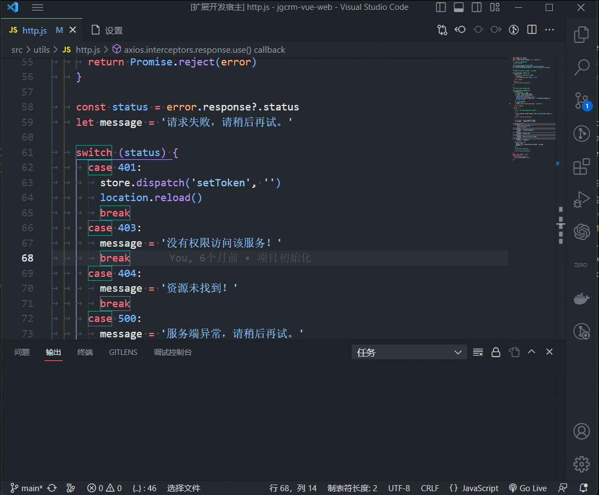
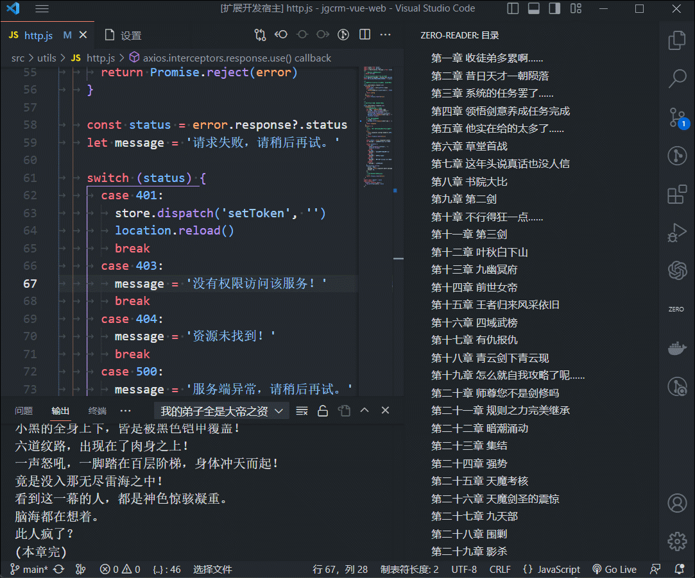

# Zero-Reader 说明

This is the README for your extension "zero-reader". You can read books in console board with a simple choose to start.Using shortcut keys can quickly hide the contents and directories of the console. This plugin is for my own use and can be used for your reference.
这是一款本地看小说的插件，选择 txt 文件后自动生成目录并在控制台输出中阅读。
使用快捷键可以快速隐藏控制台内容及目录，该插件为本人自用，可供大家参考学习使用。
> 该插件会在选择文件后自动记录文件所在位置路径，并在下次使用时自动打开该路径文件。
> The plugin will automatically record the path where the file is located after selecting the file, and automatically open the path file the next time it is used.

## 使用方法
打开方式
- 打开侧边栏选择文件，完成后自动导入目录,并在控制台打开书籍。
- 使用下方状态栏选择文件，再次使用下方状态栏选择可以更换文件。
- 使用命令行执行，按下 ctrl+shift+p，选择 zero-reader：选择文件 命令即可。
<!--  -->
 
  

## 快捷隐藏
使用 ctrl+m 快捷显示/隐藏控制台内容及侧边栏目录
<!--  -->
 
  

## 源码
该插件代码开源，可以参考使用 [zero-reader](https://github.com/wang-yes/zero-reader-vscode/zero-reader/STUDY.md)

## 更多
后续会考虑更多功能更新,欢迎大家提供思路。